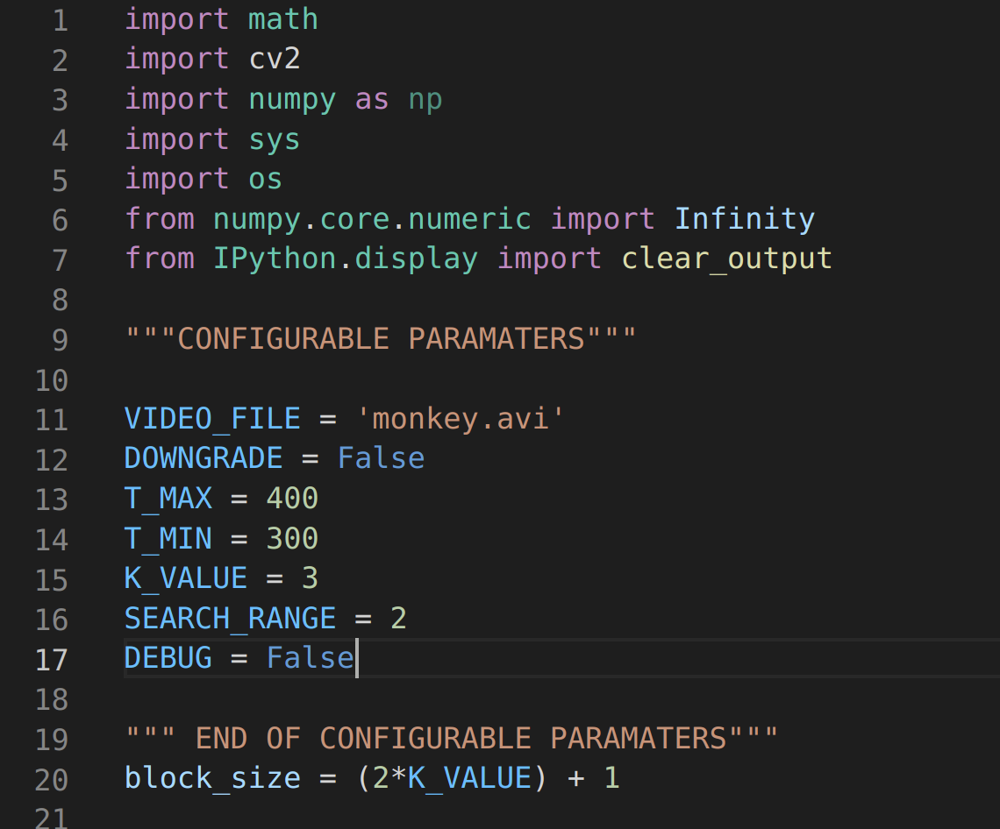
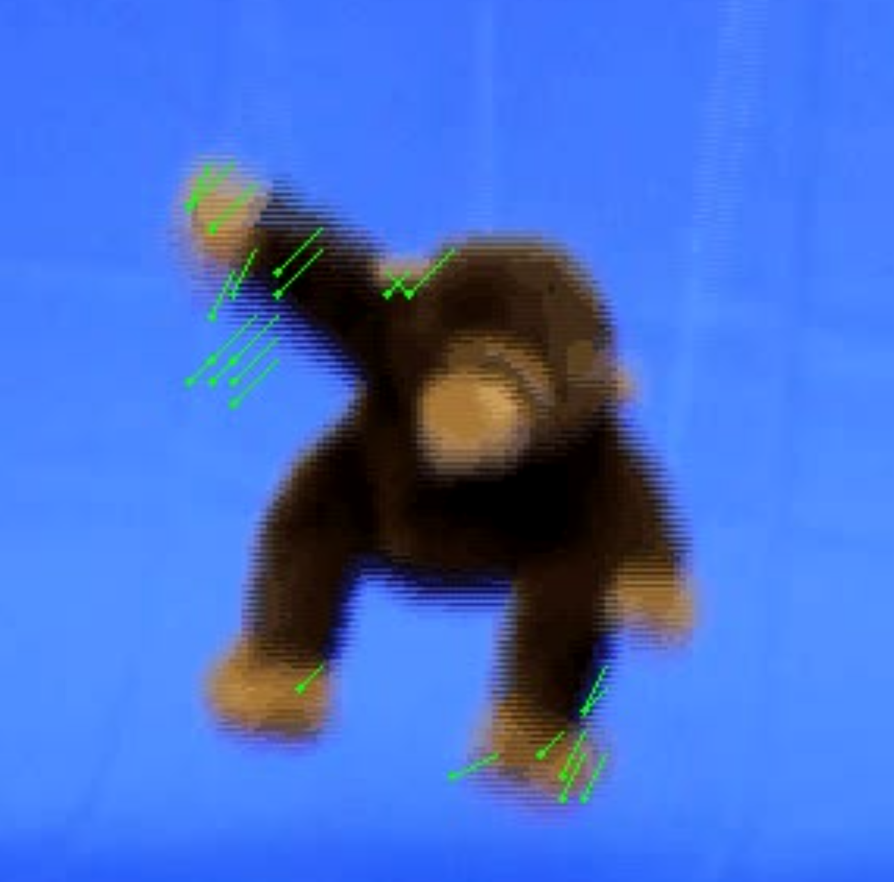
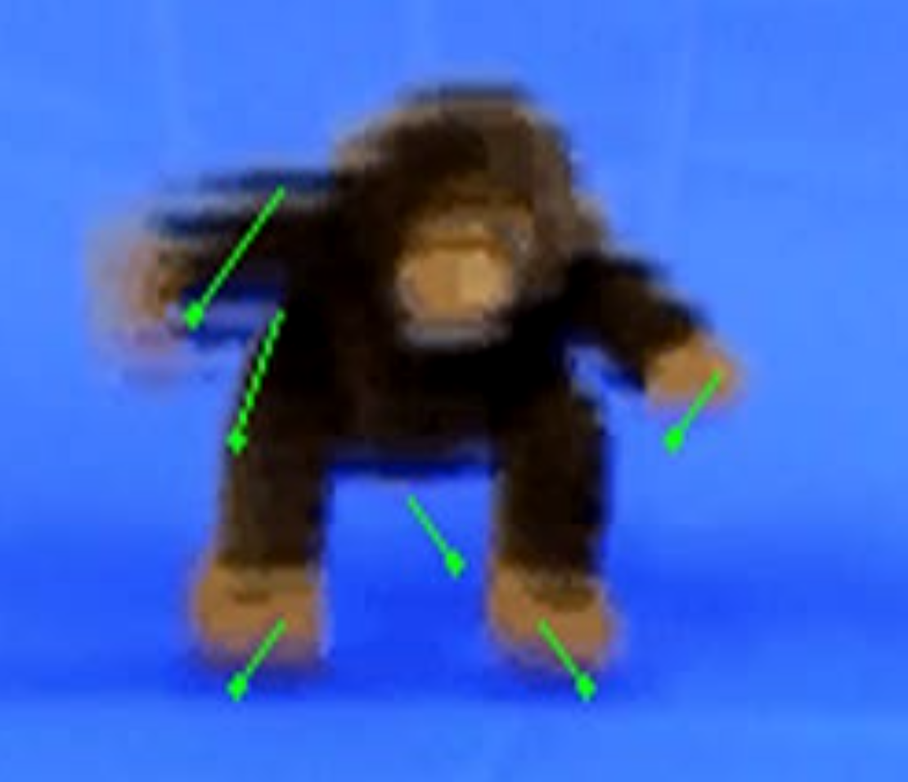
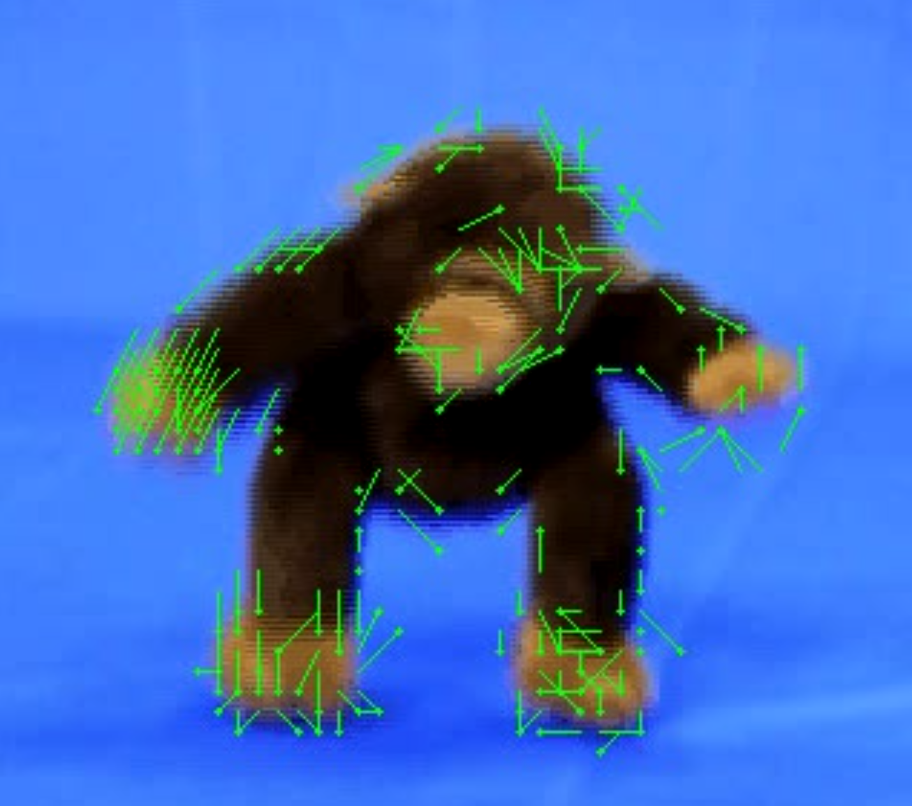

# motion_block_vis
Implementation of a motion estimation and visualisation algorithm using sqrt(SSD) macro block matching.

# How to run
`python3 helper_function.py`  will run a render on *'monkey.avi'* with the default paramters.

you may change the source video and all other paramters listed below.

A folder will be created called `'<videofilename>_processed_frames'` which will stor all .tiff generated frames.

The rendered video will be saved to the `'videos'` folder and will be called:
`'<videofilename>_k<K_VALUE>_min<T_MIN>_max<T_MAX>_downgrade_<DOWNGRADE>.mov'`

- **WARNING** numpy, cv2 and IPython must be installed prior to running.
# Configurable paramaters

## `VIDEO_FILE = '<insert releative path to src code folder>'`

- this variable should be the file name of original video you want to apply the algorithm to 
- video MUST BE located in main project folder
## `DOWNGRADE = <True | False>`

- This will lower the resolotuion of the video to 240p before applying the algorithm. it will then re-scale the video.
- **WARNING** this causes a loss in quality for the output video, but is useful for quicker rendering times.

## Threshold values
### `T_MAX = <positive integer larger than T_MIN> `
### `T_MIN = <positive integer smaller than T_MAX> `

- threshold paramaters for accepted minimum sqrt(SSD) values
- can be altered to suit the input video and block size

## `K_VALUE = <positive integer>`

- the macro blocks will be (2k + 1) x (2k + 1) and extend across the entire frame
- a smaller k value results in denser arrows
 
## `SEARCH_RANGE = <positive integer>`

- determins the search space for 'matching macro blocks' within the next frame. 
- for example. SEARCH_RANGE = 2 will have search two blocks on every side of the current frames macro block.
- **WARNING** This variable dramatically impacts the running time. A smaller value will yeild a faster render.

## `DEBUG = <False | True>`

- will render a 'grid' of macro blocks to the output frames and video. This is just an interesting visualisation. 

# Paramater experimentation
Included in the src code are a few video files. The highest quality render is `'monkey_k3_min300_max400_downgrade_False.mov'` which is a ~10s (300 frame) rendering of motion estimation on `'monkey.avi'` with no downscaling. Arrow heads are represented as a circle. The arrow start and end location communicates the direction of motion.

However, more renders have been included at a downscaled quality of 240p, showing different results with varying paramaters.

with the same k value, minimum threshold, maximum threshold and search range. The rendered video has some key differences. This is because the number of blocks for an 240p image  where k = 3 is 246, whilst the number of blocks for an image of a 720p image where k = 3 is 8463. There are fewer arrows and they are more sparsley located.

Quality may be determenined by the number of blocks analysed rather than the size of the blocks themselves. In other words, the k value is relative to the resolution of the video being processed. To determine this, k = 9 was used where all other paramters were the same without downscaling. This would give 246 blocks per frame. 

It is possible to set a k-value too large, such that no matching blocks are detected, and no arrows are drawn. Such example is `'monkey_k10_min300_max400_downgrade_True.mov'` where k = 10 on a 240p video.

Threshhold values seem to control the degree/severity of motion tracked. Higher treshold values (as seen above) tend to show fewer, and longer arrows. By lowering the threshold values to [100,200], many more shorter arrows are drawn. (`'see monkey_k3_min100_max200_downgrade_False.mov'`).

Altering the search space did not have much effect, as this video does not contain any extreme distance between frames. A larger search space for matching macroblocks significantly increases run time. Therefore, I do not have any exported videos which higher values than 2 or 3. 
